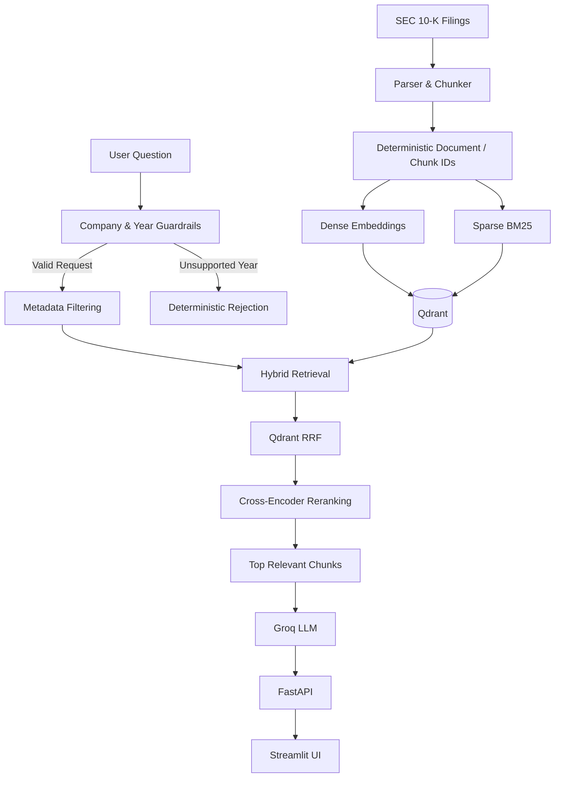

# RuleBeaconAI — SEC Filing Regulatory & Financial Document Intelligence

> A grounded RAG research assistant for querying corporate SEC 10-K filings using hybrid retrieval, Qdrant, cross-encoder reranking, deterministic guardrails, and grounded LLM generation.

---

## 1. Overview

**RuleBeaconAI** is a financial-document intelligence platform designed to answer questions over complex SEC 10-K filings.

The system is designed around common challenges in financial RAG, including:

- Metric ambiguity
- Fiscal-year confusion
- Irrelevant retrieval
- Precise financial-value extraction
- Grounded answer generation

### Current Corpus

- **55 SEC 10-K filings**
- **11 companies:** `AAPL`, `ADM`, `AMZN`, `GOOGL`, `JPM`, `META`, `MSFT`, `NFLX`, `NVDA`, `TSLA`, `WMT`
- **Fiscal years:** FY2020–FY2024
- **~39,778 indexed chunks / points**
- **Dense embeddings:** `BAAI/bge-small-en-v1.5` — 384 dimensions
- **Sparse retrieval:** Qdrant BM25
- **Fusion:** Qdrant Reciprocal Rank Fusion (RRF)
- **Reranker:** `BAAI/bge-reranker-base`
- **LLM:** Groq `openai/gpt-oss-120b`

---

## 2. Architecture



---

## 3. Key Features

### Hybrid Retrieval

Combines:

- Dense semantic search
- Sparse BM25 keyword search
- Qdrant Reciprocal Rank Fusion

This allows the system to handle both conceptual queries and exact financial terminology.

### Cross-Encoder Reranking

Retrieved candidates are reranked using:

`BAAI/bge-reranker-base`

The reranking stage also applies metric-aware logic for important financial concepts such as:

- Revenue / Net Sales
- Operating Income
- Gross Profit
- EPS
- R&D
- Total Assets

### Deterministic Year Guard

The system detects explicit fiscal-year requests and rejects requests outside the supported corpus before unnecessary retrieval or LLM processing occurs.

### Grounded Generation

The LLM receives retrieved filing evidence and is instructed to answer using that evidence rather than relying on unsupported information.

### Multi-Turn Questions

The Streamlit interface maintains relevant company and fiscal-year context for follow-up questions.

For example:

> "What were Apple's net sales in fiscal year 2023?"

followed by:

> "How did that compare with the previous year?"

---

## 4. Validation

The project includes automated validation for retrieval, generation, grounding, and year handling.

| Test | Result |
|---|---:|
| Retrieval Regression | 11/11 |
| Filing Hit@5 | 11/11 |
| Metric Hit@5 | 11/11 |
| Generation Verification | 3/3 |
| Grounding Validation | 3/3 |
| Year Guard | 3/3 |

Example validated financial values include:

- **AAPL FY2023 Net Sales:** $383.3 billion
- **ADM FY2024 Net Earnings:** $2,036 million
- **NVDA FY2024 Revenue:** $60.9 billion

---

## 5. Repository Structure

```text
RuleBeaconAI/
├── app.py
├── data/
│   └── raw/
├── scripts/
│   ├── download_corpus.py
│   └── test_incremental_ingestion.py
├── src/
│   ├── api/
│   │   └── main.py
│   ├── config/
│   │   └── settings.py
│   └── rag/
│       ├── chunker.py
│       ├── embeddings.py
│       ├── generator.py
│       ├── ingestion.py
│       ├── loader.py
│       ├── manifest.py
│       ├── parser.py
│       ├── reranker.py
│       ├── retriever.py
│       ├── schemas.py
│       ├── service.py
│       └── vectorstore.py
├── tests/
│   ├── retrieval_questions.py
│   ├── test_calculations.py
│   ├── test_generation.py
│   ├── test_grounding.py
│   ├── test_retrieval.py
│   └── test_year_guard.py
├── .env.example
├── requirements.txt
└── README.md
```

---

## 6. Getting Started

### Prerequisites

- Python 3.10+
- Qdrant instance with the populated `sec_filings` collection
- Groq API key

### Installation

```bash
git clone https://github.com/sdtech5/RuleBeaconAI.git
cd RuleBeaconAI

python -m venv .venv
```

Windows:

```bash
.\.venv\Scripts\activate
```

Linux/macOS:

```bash
source .venv/bin/activate
```

Install dependencies:

```bash
pip install -r requirements.txt
```

Create `.env` from `.env.example` and configure:

```dotenv
GROQ_API_KEY=gsk_...
QDRANT_URL=https://...
QDRANT_API_KEY=...
```

---

## 7. Running the Application

### FastAPI Backend

```bash
uvicorn src.api.main:app --reload --port 8000
```

Health check:

```text
http://127.0.0.1:8000/health
```

### Streamlit Frontend

```bash
streamlit run app.py
```

Open:

```text
http://localhost:8501
```

---

## 8. Running Tests

From the project root:

```bash
python -m tests.test_year_guard
python -m tests.test_retrieval
python -m tests.test_generation
python -m tests.test_grounding
python -m tests.test_calculations
```

---

## 9. Qdrant Document Metadata

Each indexed chunk carries deterministic document and source metadata, including:

```text
document_id
chunk_id
file_name
source
section
item
part
document_type
```

This metadata supports filtering, retrieval, source attribution, and reproducible document identification.

---

## 10. Future Improvements

Potential future work includes:

- Two-phase ingestion for safer corpus replacement
- Streaming responses through FastAPI and Streamlit
- Expansion beyond SEC 10-K filings
- Additional regulatory and financial document types