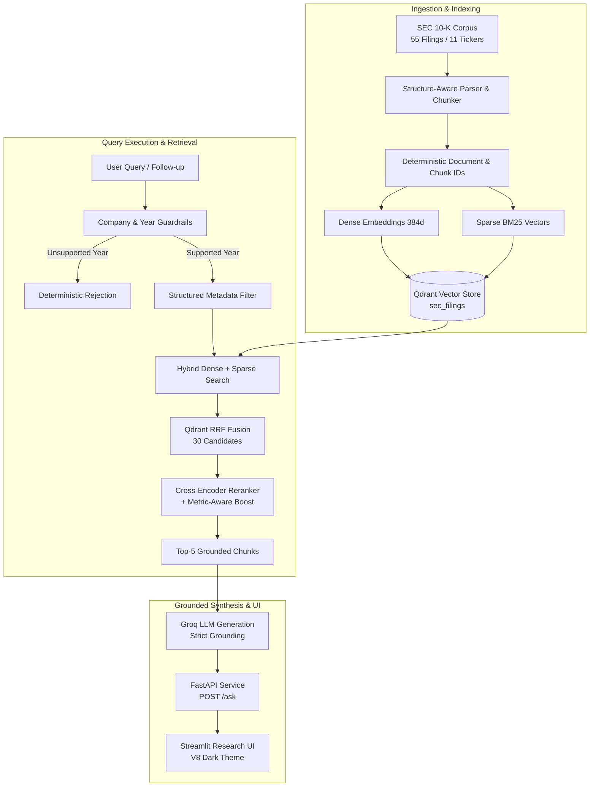

# RuleBeaconAI — SEC Filing Regulatory & Financial Document Intelligence

> A grounded RAG research assistant over corporate 10-K filings using hybrid dense/sparse retrieval, Qdrant RRF, cross-encoder reranking, metric-aware retrieval logic, deterministic document/chunk IDs, incremental ingestion, FastAPI, and a compact Streamlit research interface.

---

## 1. Overview

**RuleBeaconAI** is a specialized financial-document intelligence platform built to accurately query complex regulatory filings (SEC 10-Ks). It addresses common RAG failure modes in financial contexts—such as metric ambiguity, fiscal-year hallucination, and imprecise chunk matching—by enforcing deterministic filtering, reciprocal rank fusion (RRF), domain-specific cross-encoder reranking, and strictly grounded LLM generation.

### Target Corpus State
- **55 Corporate 10-K Filings** across 11 enterprises: `AAPL`, `ADM`, `AMZN`, `GOOGL`, `JPM`, `META`, `MSFT`, `NFLX`, `NVDA`, `TSLA`, `WMT`
- **Coverage:** Fiscal Years FY2020 – FY2024
- **Manifest & Vector Count:** 39,778 chunks / points
- **Dense Embeddings:** 384 dimensions (`BAAI/bge-small-en-v1.5`)
- **Sparse Retrieval:** BM25 (`Qdrant/bm25`)
- **Fusion:** Qdrant Native Reciprocal Rank Fusion (RRF)
- **Reranker:** `BAAI/bge-reranker-base` with metric-aware financial term boosting
- **LLM Generator:** Groq (`openai/gpt-oss-20b`) with temperature `0`

---

## 2. Architecture & Pipeline



---

## 3. Validated Evaluation Results

The system is rigorously benchmarked across 4 test suites:

| Evaluation Suite | Metric / Scope | Result | Status |
| :--- | :--- | :---: | :---: |
| **Retrieval Regression** | 11 Companies (FY2023–2024) | **11/11 (100.0%)** | Pass |
| **Filing Hit@5** | Top-5 contains target 10-K filing | **11/11 (100.0%)** | Pass |
| **Metric Hit@5** | Top-5 contains target metric term | **11/11 (100.0%)** | Pass |
| **Generation Benchmark** | Exact financial value accuracy | **3/3 (100.0%)** | Pass |
| **Grounding Validation** | 100% citation relevance to target filing | **3/3 (100.0%)** | Pass |
| **Out-of-Corpus Year Guard** | Rejects unsupported years without calling vector store/LLM | **3/3 (100.0%)** | Pass |

### Validated Reference Values
- **Apple (AAPL) FY2023 Net Sales:** `$383.3 billion`
- **Archer Daniels Midland (ADM) FY2024 Net Earnings:** `$2,036 million`
- **NVIDIA (NVDA) FY2024 Revenue:** `$60.9 billion`

---

## 4. Key Engineering Features

1. **Native Qdrant RRF Adapter (`src/rag/vectorstore.py`):**
   Fuses dense vector semantic similarity with BM25 sparse lexical matching directly within Qdrant, guaranteeing both thematic semantic relevance and precise financial keyword recall.

2. **Metric-Aware Cross-Encoder Reranking (`src/rag/reranker.py`):**
   Applies `BAAI/bge-reranker-base` over candidate pools, augmented with deterministic scoring boosts for core financial concepts (e.g., `net sales`, `operating income`, `gross profit`, `diluted earnings per share`, `r&d`, `total assets`).

3. **Deterministic Out-of-Corpus Year Guard:**
   Detects explicit fiscal year requests. If an entity filing is outside FY2020–FY2024, the request returns a deterministic response without consuming embedding, vector store, or LLM compute.

4. **Multi-Turn Context Tracking (`app.py`):**
   Enables natural follow-up inquiries (e.g., *"What were Apple's net sales in fiscal year 2023?"* followed by *"How did that compare with the previous year?"*) by propagating active entity and fiscal-year context.

5. **Responsive Research UI:**
   Compact, high-contrast dark theme designed for financial analysts. Features immediate optimistic message updating, disabled input protection to eliminate duplicate queries, a subtle `Thinking · • • •` loading indicator, and cleanly rendered collapsible source disclosures (`<details>`).

---

## 5. Repository Structure

```text
RuleBeaconAI/
├── app.py                      # Streamlit research interface (V8 baseline)
├── data/
│   └── raw/                    # 55 structured SEC 10-K filings (11 companies)
├── scripts/
│   ├── download_corpus.py      # SEC corpus downloader
│   └── test_incremental_ingestion.py
├── src/
│   ├── api/
│   │   └── main.py             # FastAPI service (endpoints: /health, /ask)
│   ├── config/
│   │   └── settings.py
│   └── rag/
│       ├── chunker.py          # Markdown section-aware chunker
│       ├── embeddings.py       # Dense embedding constructor
│       ├── generator.py        # Grounded Groq LLM interface
│       ├── ingestion.py        # Incremental manifest & ingestion pipeline
│       ├── loader.py           # Document loading utilities
│       ├── manifest.py         # Chunk and document manifest management
│       ├── parser.py           # 10-K structure parser
│       ├── reranker.py         # Metric-boosted cross-encoder reranker
│       ├── retriever.py        # Hybrid retrieval orchestration
│       ├── schemas.py          # Data classes (RetrievalResult, SourceReference)
│       ├── service.py          # Core RAG orchestration service
│       └── vectorstore.py      # Qdrant RRF hybrid store adapter
├── tests/
│   ├── retrieval_questions.py  # 11 standardized retrieval test cases
│   ├── test_generation.py     # Value-accuracy generation test suite
│   ├── test_grounding.py      # Source-attribution validation
│   ├── test_retrieval.py      # 11-company retrieval regression suite
│   └── test_year_guard.py     # Out-of-corpus guardrail tests
├── .env.example                # Template configuration variables
├── requirements.txt            # Python dependencies
└── README.md
```

---

## 6. Getting Started

### Prerequisites
- Python 3.10+
- Access to a running Qdrant cluster (Cloud or local) with the populated `sec_filings` collection
- Groq API Key

### Installation

1. Clone or navigate to the repository directory:
   ```bash
   cd RuleBeaconAI
   ```

2. Create and activate a virtual environment:
   ```bash
   python -m venv .venv
   # Windows:
   .\.venv\Scripts\activate
   # Linux/macOS:
   source .venv/bin/activate
   ```

3. Install required dependencies:
   ```bash
   pip install -r requirements.txt
   ```

4. Configure environment variables:
   Copy `.env.example` to `.env` and fill in your credentials:
   ```bash
   cp .env.example .env
   ```
   Ensure the following keys are populated in `.env`:
   ```dotenv
   GROQ_API_KEY=gsk_...
   QDRANT_URL=https://...
   QDRANT_API_KEY=...
   ```

---

## 7. Running the Application

### 1. Launch FastAPI Backend
```bash
uvicorn src.api.main:app --reload --port 8000
```
- Health Check: `GET http://127.0.0.1:8000/health`
- Ask Endpoint: `POST http://127.0.0.1:8000/ask`

### 2. Launch Streamlit Frontend
```bash
streamlit run app.py
```
Open your browser at `http://localhost:8501`.

---

## 8. Running the Regression & Validation Suite

Run each suite from the repository root:

```bash
# 1. Year Guardrail Suite (deterministic out-of-corpus checks)
python -m tests.test_year_guard

# 2. Retrieval Regression Suite (11 companies, Filing & Metric Hit@5)
python -m tests.test_retrieval

# 3. Generation Verification Suite (exact value checks)
python -m tests.test_generation

# 4. Grounding Verification Suite (source filing attribution)
python -m tests.test_grounding
```

---

## 9. Payload Schema & Contract

Qdrant documents store content and metadata according to the following canonical schema:

```text
payload = {
    "text": "...",             # -> LangChain Document.page_content
    "document_id": "...",      # Unique document hash
    "chunk_id": "...",         # Deterministic chunk ID
    "file_name": "10-K_2023.md",
    "source": "data\\raw\\AAPL\\10-K_2023.md",
    "section": "Item 8. Financial Statements...",
    "item": "Item 8",
    "part": "Part II",
    "document_type": "10-K"
}
```

---

## 10. Future Production Hardening
- **Two-phase Ingestion**: Upload replacement chunks $\to$ verify point count $\to$ delete old chunks.
- **Streaming Response**: Migrate FastAPI and Streamlit to true server-sent events (SSE) token streaming.
- **Corpus Expansion**: Ingest regulatory circulars (SEBI, RBI) and fund disclosures (SIDs, KIMs, SAIs) following the established deterministic chunking and metadata contracts.
